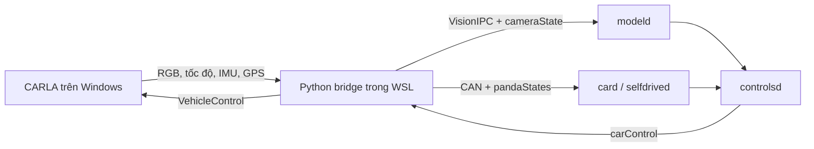

# Openpilot kết nối CARLA như thế nào?

> Đường dẫn trong tài liệu đã được cập nhật theo layout hiện tại (mã nguồn nằm
> dưới `openpilot/`). Các đoạn code trích dẫn được chép lại từ thời điểm viết
> (commit `4304ea8`) nên có thể lệch so với file thật; khi khác nhau, file
> nguồn là đúng.

Tài liệu này dành cho người chưa biết CARLA, WSL hoặc kiến trúc openpilot. Mục
tiêu là đọc từ trên xuống và hiểu được từng dòng quan trọng trong đường kết nối,
không cần biết trước về xe tự lái.

## 1. Bốn khái niệm cần biết

- **CARLA** là thế giới 3D chạy trên Windows. Nó chứa đường, xe Tesla giả lập,
  camera và vật lý.
- **Openpilot** chạy trong Ubuntu WSL. Nó nhận hình ảnh/CAN như đang nối với xe
  thật, sau đó xuất lệnh đánh lái, tăng tốc và phanh.
- **Bridge** là chương trình Python đứng giữa hai bên. Nó dịch dữ liệu CARLA
  thành dữ liệu openpilot hiểu được và dịch lệnh openpilot trở lại CARLA.
- **Message bus** là hệ thống pub/sub của openpilot. Một process gửi message,
  các process khác đăng ký nhận message đó mà không gọi trực tiếp lẫn nhau.

Luồng hoàn chỉnh:



Đây là vòng lặp kín: CARLA tạo dữ liệu → openpilot tính toán → CARLA nhận điều
khiển → trạng thái xe thay đổi → vòng lặp tiếp tục.

## 2. Điểm bắt đầu: `run.sh all`

File: `openpilot/tools/sim/carla/run.sh`.

Người dùng chạy:

```bash
bash openpilot/tools/sim/carla/run.sh all
```

Các dòng quan trọng:

| Dòng | Ý nghĩa dễ hiểu |
| --- | --- |
| 1 | `#!/usr/bin/env bash` yêu cầu Linux chạy file bằng Bash. |
| 2 | `set -euo pipefail` dừng ngay khi có lỗi, biến chưa khai báo hoặc một lệnh trong pipeline thất bại. |
| 4 | Tự tìm thư mục gốc openpilot dựa trên vị trí của `run.sh`; không phụ thuộc repo nằm ở máy nào. |
| 5-6 | Đặt thư mục runtime `.carla` và thư mục log. |
| 7 | Thêm `.carla/bin` vào `PATH` để tìm được `uv`. |
| 8 | Tắt buffering để log bridge xuất hiện ngay. |
| 10-13 | Kiểm tra đây thật sự là repo openpilot bằng sự tồn tại của `pyproject.toml`. |
| 15 | Chuyển terminal vào repo root. Mọi path tương đối sau đó bắt đầu ở đây. |
| 18-23 | Đưa cache Python và file tạm vào WSL VHD đã đặt trên D:. |
| 24 | Đọc default gateway của WSL. Địa chỉ này chính là phía Windows mà CARLA đang chạy. |
| 25 | Chọn cổng CARLA RPC, mặc định `2000`. |
| 26 | Chặn `soundd` vì simulator không cần thiết bị âm thanh thật. |
| 29-33 | UI bật mặc định; `OPENPILOT_UI=0` mới chuyển sang chế độ CI không UI. |

Hàm gọi Windows:

```bash
windows_launcher() {
  local script_path
  script_path="$(wslpath -w "$OPENPILOT_ROOT/openpilot/tools/sim/carla/run.ps1")"
  powershell.exe -NoProfile -ExecutionPolicy Bypass -File "$script_path" "$@"
}
```

Giải thích từng dòng:

1. `windows_launcher()` tạo một hàm Bash có thể gọi nhiều lần.
2. `local script_path` tạo biến chỉ tồn tại bên trong hàm.
3. `wslpath -w` đổi path Linux `/mnt/d/...` thành path Windows `D:\...`.
4. `powershell.exe ... -File` vượt ranh giới WSL → Windows và chạy `run.ps1`.
5. `"$@"` chuyển nguyên các tham số như `start`, `-Visible` sang PowerShell.

Hàm mở server:

```bash
start_server() {
  if [[ "${CARLA_HEADLESS:-0}" == "1" ]]; then
    windows_launcher start "$@"
  else
    windows_launcher start -Visible "$@"
  fi
}
```

- Nếu `CARLA_HEADLESS=1`, CARLA render offscreen.
- Nếu không, `-Visible` mở cửa sổ CARLA bình thường.

Hàm mở bridge:

```bash
start_bridge() {
  uv run --extra carla openpilot/tools/sim/run_bridge.py \
    --simulator carla --dual_camera --carla-host "$CARLA_HOST" --carla-port "$CARLA_PORT" "$@" \
    2>&1 | tee "$LOG_ROOT/bridge.log"
  return "${PIPESTATUS[0]}"
}
```

1. `uv run --extra carla` dùng đúng Python environment và dependency CARLA.
2. `run_bridge.py` là entry point Python chung của simulator.
3. `--simulator carla` chọn backend CARLA thay vì MetaDrive.
4. `--dual_camera` bật camera road và wide-road giống thiết bị openpilot.
5. `--carla-host` truyền IP Windows đã tìm ở trên.
6. `--carla-port` truyền cổng RPC 2000.
7. `"$@"` cho phép thêm `--high_quality`, map hoặc spawn point.
8. `2>&1` gộp lỗi và output thường.
9. `tee` vừa hiện output lên terminal vừa ghi `bridge.log`.
10. `PIPESTATUS[0]` trả đúng exit code của bridge, không phải của `tee`.

Nhánh `all` ở dòng 90-94 thực thi đúng thứ tự:

```bash
start_server
export OPENPILOT_MANAGER_LOG="$LOG_ROOT/openpilot.log"
start_bridge --launch-openpilot
```

Nghĩa là: mở CARLA Windows → đặt file log manager → mở bridge và yêu cầu bridge
sở hữu vòng đời openpilot manager.

## 3. Windows mở CARLA

File: `openpilot/tools/sim/carla/run.ps1`.

Các biến đầu file tạo layout runtime:

| Biến | Giá trị |
| --- | --- |
| `$RepoRoot` | Repo hiện tại, được suy ra từ vị trí script. |
| `$StateRoot` | `<repo>\.carla`. |
| `$InstallRoot` | `.carla\CARLA_0.9.16`. |
| `$CarlaShippingExe` | Executable vật lý của Unreal Engine. |

Trong nhánh `start`, script tạo danh sách argument:

```powershell
$carlaArguments = @(
  '-quality-level=Low', "-carla-rpc-port=$Port", '-windowed',
  '-ResX=1280', '-ResY=720', '-nosound', '-log', "-abslog=..."
)
```

- `quality-level=Low` giảm tải GPU.
- `carla-rpc-port` mở API mà Python bridge sẽ kết nối.
- `windowed`, `ResX`, `ResY` tạo cửa sổ 1280×720.
- `nosound` tránh thiết bị âm thanh không cần thiết.
- `abslog` ép log về ổ chứa repo.

`Start-Process` cuối nhánh thực sự tạo process `CarlaUE4.exe`. Từ thời điểm này,
Windows đã có CARLA server nhưng chưa có ego vehicle; ego được bridge tạo sau.

## 4. Python entry point mở openpilot và bridge

File: `openpilot/tools/sim/run_bridge.py`.

### Chọn backend

```python
if simulator == "carla":
  from openpilot.tools.sim.bridge.carla.carla_bridge import CarlaBridge
  simulator_bridge = CarlaBridge(dual_camera, high_quality, **kwargs)
else:
  ... MetaDriveBridge ...
```

- Dòng `if` đọc giá trị `--simulator carla` từ command line.
- Import nằm bên trong nhánh để người dùng MetaDrive không cần cài CARLA.
- `CarlaBridge(...)` tạo object cấu hình, chưa tạo xe ngay.

### Mở manager

Khi có `--launch-openpilot`, dòng 45-65 làm các việc sau:

1. Import `BASEDIR` để tìm repo.
2. Mở `Params`, database key/value của openpilot.
3. Xóa riêng `Offroad_ExcessiveActuation` còn sót từ lần simulator bị ngắt.
4. Đặt `AlphaLongitudinalEnabled=False`; Honda giả lập dùng stock ACC do bridge
   mô phỏng, còn openpilot điều khiển lateral.
5. Mở `.carla/logs/openpilot.log`.
6. `subprocess.Popen(["./launch_openpilot.sh"], ...)` tạo manager process.

Bridge là process cha của manager. Khối `finally` ở cuối file luôn terminate
manager khi bridge thoát, tránh nhiều manager mồ côi tranh cùng message bus.

### Tạo bridge process

```python
queue, simulator_process, simulator_bridge = create_bridge(...)
```

- `queue` nhận phím từ terminal.
- `simulator_process` chạy vòng lặp bridge riêng.
- `simulator_bridge` là object cha dùng để shutdown/join.

`keyboard_poll_thread(queue)` giữ terminal chờ `W/S/A/D`, `R`, `2`, `Q`.

## 5. `launch_openpilot.sh` mở hệ điều hành openpilot

File: `openpilot/tools/sim/launch_openpilot.sh` chỉ có 28 dòng.

| Dòng | Giải thích |
| --- | --- |
| 3 | `PASSIVE=0`: cho phép openpilot điều khiển, không chỉ quan sát. |
| 4 | `NOBOARD=1`: không yêu cầu panda phần cứng thật. |
| 5 | `SIMULATION=1`: báo mọi process rằng đây là simulator. |
| 6 | Bỏ truy vấn firmware ECU thật. |
| 7 | Ép fingerprint Honda Civic 2022 khớp CAN giả lập. |
| 9 | Chặn camerad thật và logger/audio không cần thiết; bridge sẽ thay camerad. |
| 10-13 | Trong CI thì chặn UI; interactive bình thường vẫn mở UI. |
| 15-17 | Tìm repo root và đặt `PYTHONPATH` hoạt động trên DrvFS `/mnt/d`. |
| 18-20 | Đưa `.venv/bin` lên đầu `PATH`. |
| 22 | Ghi Params cần thiết để vượt màn hình setup/training trong simulator. |
| 25 | Chuyển vào `openpilot/system/manager`. |
| 28 | `exec ./manager.py`: thay shell bằng openpilot manager. |

Manager sau đó tự spawn `card`, `modeld`, `controlsd`, `selfdrived`, UI và các
process định vị/lập kế hoạch.

## 6. Cấu hình CARLA bridge

File: `openpilot/tools/sim/bridge/carla/carla_bridge.py`.

```python
class CarlaBridge(SimulatorBridge):
```

`CarlaBridge` kế thừa vòng lặp chung `SimulatorBridge`; file này chỉ định những
điểm khác biệt của CARLA:

- `TICKS_PER_FRAME = 5`: loop điều khiển 100 Hz, CARLA tick mỗi 5 loop = 20 Hz.
- `alpha_longitudinal_enabled = False`: dùng stock ACC giả lập.
- `openpilot_startup_delay = 3.0`: chờ tối thiểu ba giây và còn phải thấy
  `selfdriveState` alive.
- `startup_throttle = 0.25`: ga nhẹ để xe lăn trước engagement đầu.
- `stock_cruise_speed = 8.0`: stock ACC nhắm tới 8 m/s.
- `host`, `port`, `town`, `spawn_point`: thông số lấy từ command line.
- `spawn_world()` trả về `CarlaWorld`, lớp làm việc trực tiếp với CARLA API.

## 7. Kết nối RPC và tạo thế giới

File: `openpilot/tools/sim/bridge/carla/carla_world.py`.

### Kết nối

```python
self.client = carla.Client(host, port)
self.client.set_timeout(120.0)
self.world = self.client.load_world_if_different(town) or self.client.get_world()
```

1. `carla.Client(host, port)` mở TCP từ WSL tới CARLA Windows.
2. Timeout 120 giây cho map lớn tải xong.
3. Nếu map chưa đúng thì load map; nếu đúng rồi thì lấy world hiện tại.

Đây chính là điểm “connect tới CARLA” theo nghĩa mạng.

### Đồng bộ thời gian

```python
settings.synchronous_mode = True
settings.fixed_delta_seconds = 0.05
self.world.apply_settings(settings)
```

- Synchronous mode nghĩa là CARLA chỉ tiến thêm khi bridge gọi `world.tick()`.
- `0.05` giây mô phỏng mỗi tick tương đương 20 FPS.
- Nhờ vậy camera, CAN và trạng thái xe thuộc cùng một thời điểm.

### Tạo xe và sensor

```python
vehicle_bp = ...find("vehicle.tesla.model3")
vehicle_bp.set_attribute("role_name", "hero")
self.vehicle = self.world.try_spawn_actor(vehicle_bp, self.spawn_transform)
```

- Blueprint là mẫu xe CARLA.
- `hero` đánh dấu đây là ego vehicle.
- `try_spawn_actor` đặt xe tại spawn point đã chọn.

Sau đó `_spawn_camera("road", 40.0, ...)` tạo camera hẹp và camera 120° tạo ảnh
wide-road. `_spawn_gnss()` và `_spawn_imu()` tạo GPS/IMU. Callback `sensor.listen`
đưa dữ liệu mới nhất vào queue Python.

### Gửi lệnh vào CARLA

`apply_controls()` dòng 122-132:

```python
steer = -steer_angle / (max_wheel_angle * steer_ratio)
control = carla.VehicleControl(
  throttle=clip(throttle_out, 0, 1),
  steer=clip(steer, -1, 1),
  brake=clip(brake_out, 0, 1),
)
self.vehicle.apply_control(control)
```

1. Openpilot dùng độ vô-lăng; CARLA dùng số chuẩn hóa `-1..1`, nên phải đổi đơn vị.
2. Dấu trừ sửa khác biệt quy ước trái/phải.
3. Throttle và brake bị giới hạn `0..1` để không gửi giá trị vô lý.
4. `vehicle.apply_control` là điểm cuối: CARLA nhận lệnh lái thật sự.

### Đọc kết quả

`read_sensors()` đọc velocity, steering angle, transform, GPS và IMU từ actor,
rồi ghi vào một `SimulatorState`. Lần loop kế tiếp sẽ biến state này thành CAN.

`tick()` gọi `world.tick()` và cập nhật spectator phía sau ego vehicle, nên cửa
sổ CARLA luôn follow theo xe.

## 8. Bridge giả lập camera và CAN

File: `openpilot/tools/sim/bridge/common.py` chứa vòng lặp trung tâm.

### Hai thread nền

```python
SimulatedCar.update(...), 100 Hz
SimulatedSensors.send_camera_images(...), 20 Hz
```

- Thread CAN chạy 100 lần/giây giống bus xe.
- Thread camera chạy 20 lần/giây giống camera model.

### Handshake startup

Bridge ban đầu gửi CAN/camera nhưng giữ ga bằng 0. Mỗi loop nó kiểm tra:

```python
self.simulated_car.sm.alive['selfdriveState']
```

`SubMaster` là subscriber. Khi `selfdriveState` alive, nghĩa là manager, card và
selfdrived đã khởi động đủ để xử lý engagement. Trạng thái này được latch một
chiều để một frame chậm không làm xe quay lại startup.

### Engagement

Với Honda stock ACC, openpilot cần thấy cạnh cruise OFF → ON. Bridge pulse
`stock_cruise_enabled` mỗi 0.5 giây cho tới khi:

```python
self.simulator_state.is_engaged = sm['selfdriveState'].active
```

Sau ba giây active liên tục, bridge giữ stock ACC ON. Nhấn `R` hoặc `2` sẽ ép
OFF 0.5 giây rồi tạo cạnh ON mới để re-engage.

### Nhận lệnh openpilot

```python
steer_op = sm['carControl'].actuators.steeringAngleDeg
```

`controlsd` publish `carControl`; bridge subscribe message đó. Với cấu hình stock
longitudinal, bridge dùng bộ điều khiển tốc độ nhỏ để giữ 8 m/s:

```python
speed_error = 8.0 - current_speed
throttle = clip(speed_error * 0.18, 0, 0.5)
brake = clip(-speed_error * 0.12, 0, 0.4)
```

- Xe chậm hơn 8 m/s → error dương → thêm ga.
- Xe nhanh hơn 8 m/s → error âm → thêm phanh.
- Openpilot vẫn quyết định góc lái.

Nếu người dùng nhấn `W/S/A/D`, manual control được ưu tiên trong 250 ms để luôn
có thể thoát vật cản ngay cả khi openpilot đang engaged.

Cuối loop:

```python
self.world.apply_controls(steer_out, throttle_out, brake_out)
self.world.read_sensors(self.simulator_state)
self.world.tick()
```

Ba dòng này đóng vòng lặp: gửi lệnh → đọc xe mới → cho thế giới tiến thời gian.

## 9. CAN giả đi vào openpilot

File: `openpilot/tools/sim/lib/carla_simulated_car.py`.

```python
self.pm = messaging.PubMaster(['can', 'pandaStates'])
self.sm = messaging.SubMaster(['carState', 'carControl', 'carOutput', ..., 'selfdriveState'])
```

- `PubMaster` gửi CAN và pandaStates cho openpilot.
- `SubMaster` nhận kết quả điều khiển từ openpilot.

`send_can_messages()` đóng gói tốc độ, gear, standstill, góc lái, torsion bar
torque, cruise và blinker theo DBC Tesla Model 3 (`tesla_model3_party`), chia
trên hai bus `CANBUS.party` và `CANBUS.autopilot_party`. Dòng cuối:

```python
self.pm.send('can', can_list_to_can_capnp(msg))
```

publish danh sách CAN lên message bus. Process `card` tưởng rằng đây là CAN đến
từ một chiếc Tesla Model 3 thật.

MetaDrive vẫn dùng `openpilot/tools/sim/lib/simulated_car.py` (Honda Civic
2022). CARLA chọn class nào qua `simulated_car_class` trong `CarlaBridge`.

`send_panda_state()` giả panda hardware, ignition, safety model và
`controlsAllowed`. Safety config được lấy từ `carParams` để tránh
`controlsMismatch`.

## 10. Camera giả đi vào modeld

File: `openpilot/tools/sim/lib/simulated_sensors.py` và `openpilot/tools/sim/lib/camerad.py`.

1. CARLA callback đưa ảnh BGRA vào `CarlaWorld`.
2. `_rgb()` đổi BGRA thành RGB.
3. `send_camera_images()` khóa đúng một frame road + wide-road.
4. `rgb_to_nv12()` đổi RGB thành NV12 vì modeld không nhận RGB trực tiếp.
5. Hai camera dùng cùng `time.monotonic_ns()` để không bị “frames out of sync”.
6. `VisionIpcServer.send()` gửi bytes ảnh qua shared memory VisionIPC.
7. Đồng thời `roadCameraState`/`wideRoadCameraState` được publish lên message bus.
8. `modeld` nhận ảnh, chạy neural network và publish `modelV2`.

`openpilot/selfdrive/modeld/modeld.py` có nhánh `SIMULATION`: VisionIPC buffer giả lập nằm
trong CPU shared memory, nên dữ liệu được copy sang GPU trước khi warp/model chạy.

## 11. Ai tạo `carControl`?

Không có lời gọi trực tiếp từ bridge tới `controlsd`:

1. `card` đọc `can`, tạo `carState` và `carParams`.
2. `modeld` đọc camera, tạo `modelV2`.
3. `selfdrived` quyết định enabled/active và tạo `selfdriveState`.
4. `plannerd` lập kế hoạch chuyển động.
5. `controlsd` kết hợp carState + plan + model để publish `carControl`.
6. `SimulatedCar.sm` nhận `carControl`.
7. `SimulatorBridge` đổi actuator thành lệnh CARLA.

Đó là lý do phải chạy manager: manager tạo toàn bộ chuỗi process ở giữa.

## 12. Cách tự debug một vòng lặp

Chạy:

```bash
tail -f .carla/logs/bridge.log
```

Một trạng thái tốt trông như:

```text
Ignition: True Engaged: True Speed: 6.05 m/s
Controls: steer=1.20 throttle=0.35 brake=0.00 OP-long=False
```

- `Ignition=True`: CAN đang báo xe bật.
- `Engaged=True`: selfdrived đã active.
- `Speed>0`: CARLA physics đang di chuyển.
- `OP-long=False`: openpilot lateral + stock ACC bridge, đúng thiết kế hiện tại.
- `steer` thay đổi: openpilot đang gửi góc lái.
- `throttle/brake`: lệnh cuối bridge gửi CARLA.

Nếu cần xem manager:

```bash
tail -f .carla/logs/openpilot.log
```

Nếu cần reset sau crash, focus terminal bridge và nhấn `R`. Nếu xe chưa cần
reset vị trí nhưng mất engagement, nhấn `2`.

